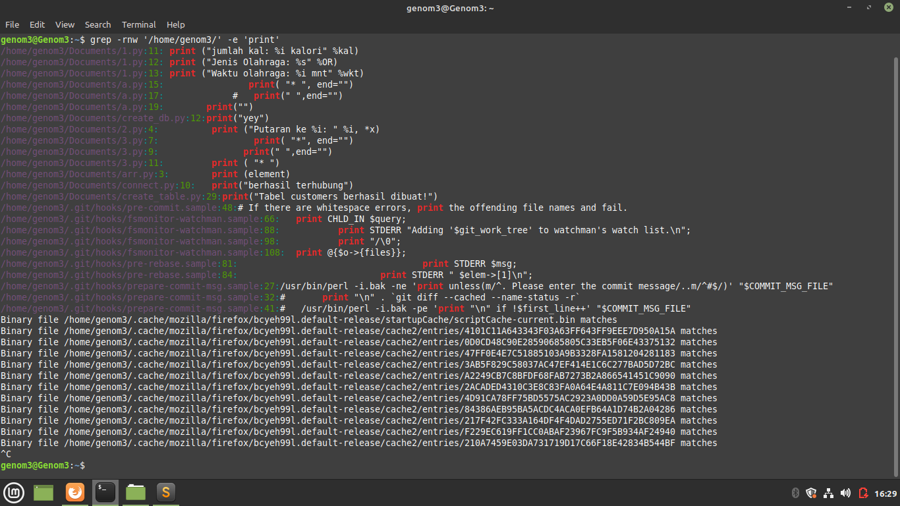

**JAWABAN**
 
Untuk mencari file dengan hanya isinya saja yang diketahui bisa menggunakan command grep dengan optionnya
 
Perintahnya dengan mengetikan grep -rnw '/pathnya/misal/home/' -e 'isi kalimatnya yang dicari'
 
 
-r rekursif yang berati akan mencari di lokasi itu berulang
 
-n menunjukan pada line number berapa di file tersebut ditemukan
 
-w yang menunjukan seluruh kalimatnya atau word nya
 
lalu masukan path direktorinya yang akan dicari
 
-e untuk penggunaan pattern untuk matching kalimatnya
 
berikut hasil screenshootnya untuk mencari file yang berisi print
 

