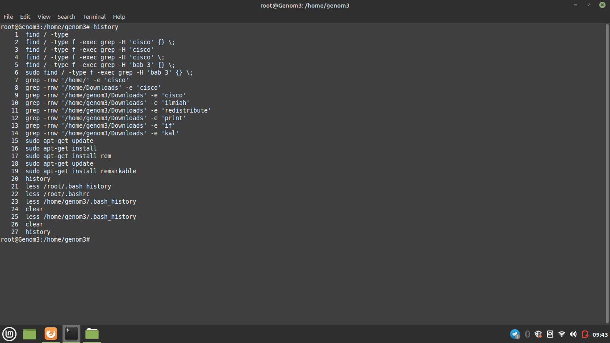
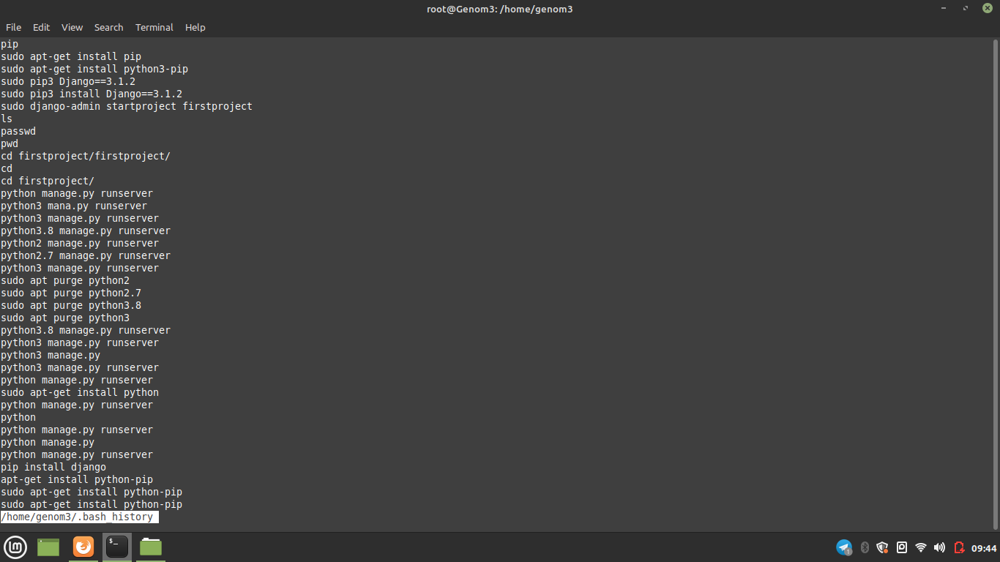
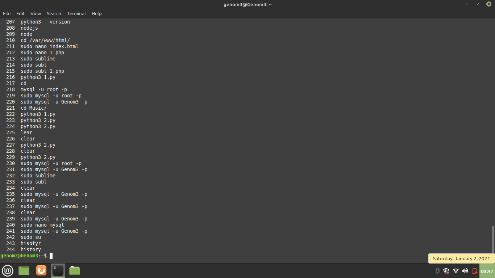

**JAWABAN**
 
Untuk melihat command yang sebelumnya pernah diketikan bisa dengan command history pada user tersebut atau bisa juga melihat melalui lognya dengan 
command less /root/.bash_history jika login dengan root dan less /home/namausernya/.bash_history jika login sebagai user
 
Contoh penggunaannya
 

(Penggunaan history pada root)

(Penggunaan less /home/namauser/,bash_history)

(Penggunaaan history pada user biasa)

