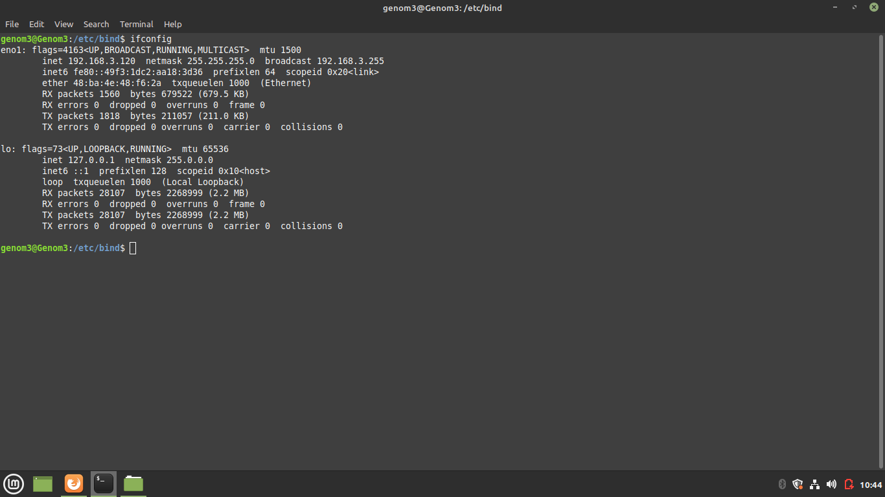
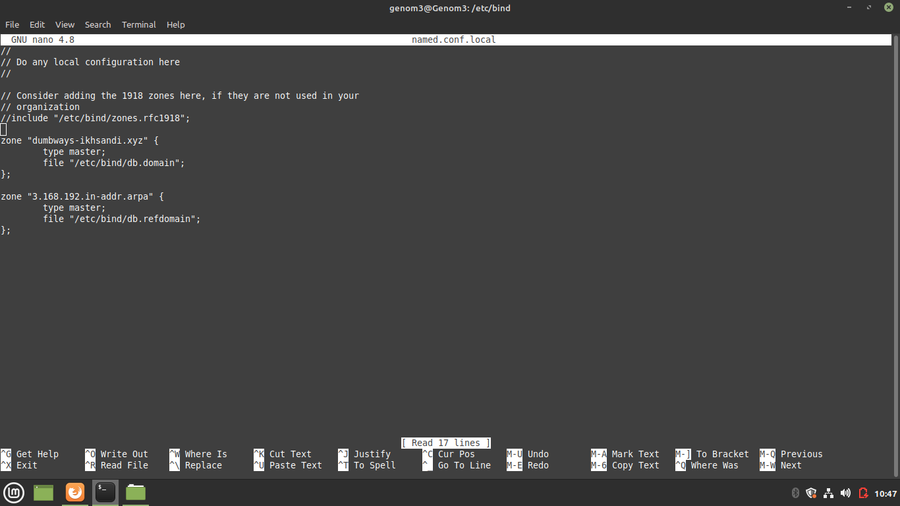
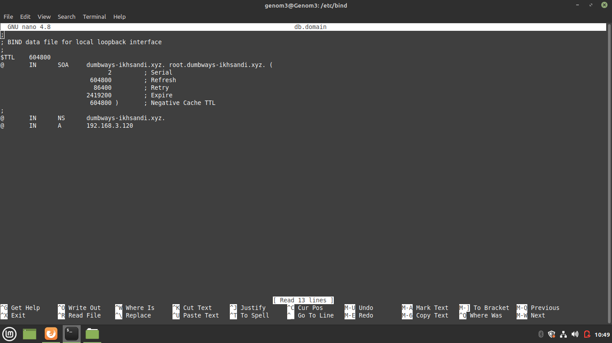
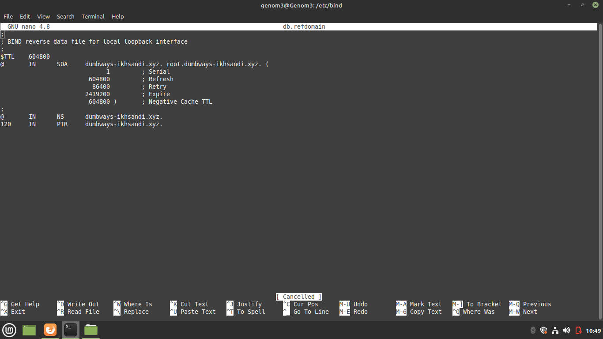
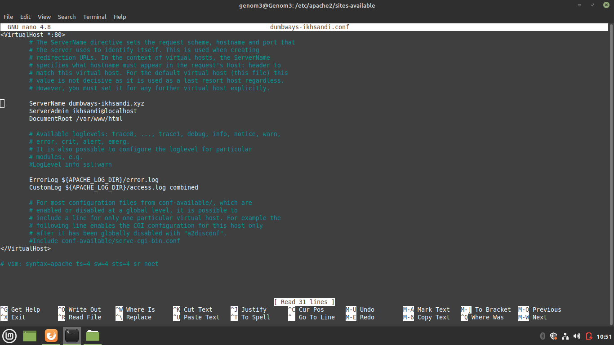

**JAWABAN**
 
Untuk membuat web server local ini hal yang harus di install yaitu phpmyadmin, apache, php dan juga bind9 sebagai dns servernya karna jika tidak menggunakan dns server
maka akan tetap menjadi localhost untuk mengaksesnya dan bukan dengan nama domain yang kita inginkan
  
Pertama harus mengecek dulu ip yang akan digunakan sebagai web servernya, karna web servernya pada pc/laptop sendiri maka ketikan **ifconfig** untuk melihat ip 
pada pc/laptop kita, sebagai contoh disini ip saya 192.168.3.120

 
Lalu install bind9 dulu dengan perintah apt-get install bind9, setelah diinstall ketikan perintah text editor untuk mengedit file named.conf.options di /etc/bind/
dan uncomment bagian forwarders agar bisa tetap terhubung ke internet meski dns yang dimasukan hanya dns server kita, disini menggunakan dns google yaitu 8.8.8.8

 
Lalu kita mengedit file named.conf.local karena kita menggunakan local dns, masukan zone seperti pada gambar untuk nama domainnya dan zone untuk ipnya sesuai 
class network secara terbalik dengan type master dan file untuk menunjukan lokasi databasenya

 
Copy db.local ke db.domain dan db.127 ke db.refdomain, disini db.domain dan db.refdomain merupakan database yang sudah disebutkan dibagian file zone yang kita buat tadi
, setelah dicopy mulai edit db.domain dan isi seperti pada gambar, yang awalnya localhost semua diganti dengan domain yang akan dibuat lalu pada bagian NS untuk 
NameServer diganti dengan nama domain dan A untuk alamat ip versi 4 masukan alamat ip pc yang sudah dilihat diawal

 
edit db.refdomain dan bagian localhost semua diganti juga dengan nama domain dan dibagian ptr sebelah kiri diganti dengan host ip dan domainnya dengan domain kita

 
Jika sudah selesai maka tinggal mengganti dns pada pc/laptop masing masing dengan alamat dns ip yang sudah dibuat tadi

 
Dan terakhir membuat web servernya dengan menginstall php, phpmyadmin dan apachenya. Jika sudah terinstall masuk ke direktori /etc/apache2/sites-available untuk 
mengcopy file 000-default.conf ke namadomain.conf disini menggunakan dumbways-ikhsandi.conf, di dumbways-ikhsandi.conf ini uncomment servernamenya dan diisi dengan nama domain yang dibuat tadi lalu untuk server 
admin bisa digantikan dengan nama domain atau nama kalian dan untuk document root digunaan untuk melokasikan dimana file file untuk web server ini dapat diakses 
atau diganti, untuk virtualhostnya biarkan 80 karna menggunakan http bukan https

 
Dan bagian terakhir ketikan a2ensite dumbways-ikhsandi.conf untuk mengaktifkan web server yang sudah diconfig tersebut dan a2dissite 000-default.conf untuk menonaktifkan
defaultnya
